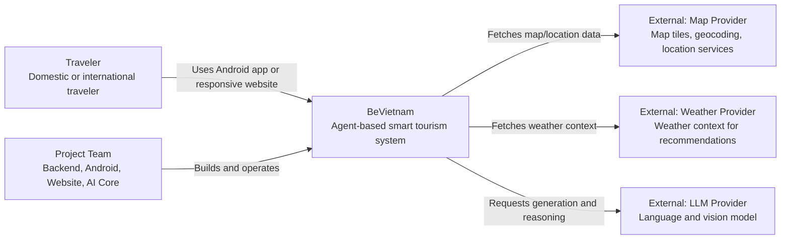
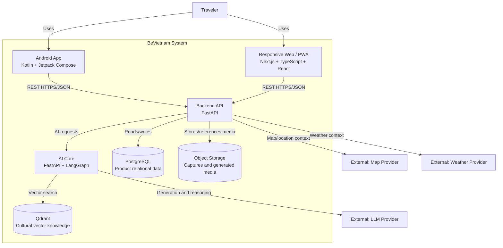
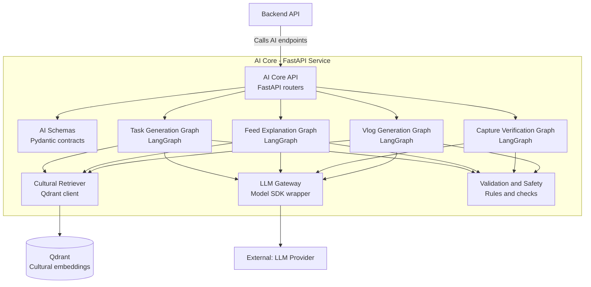
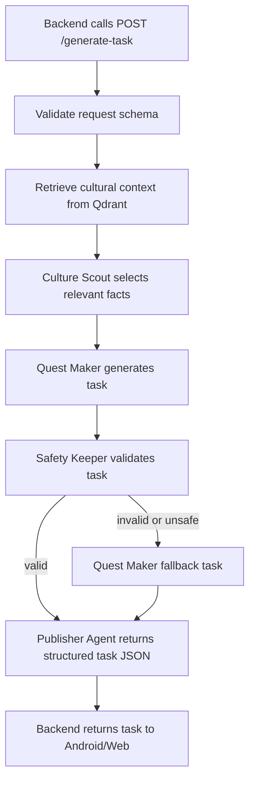
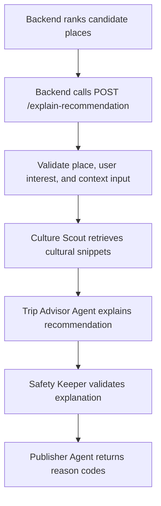
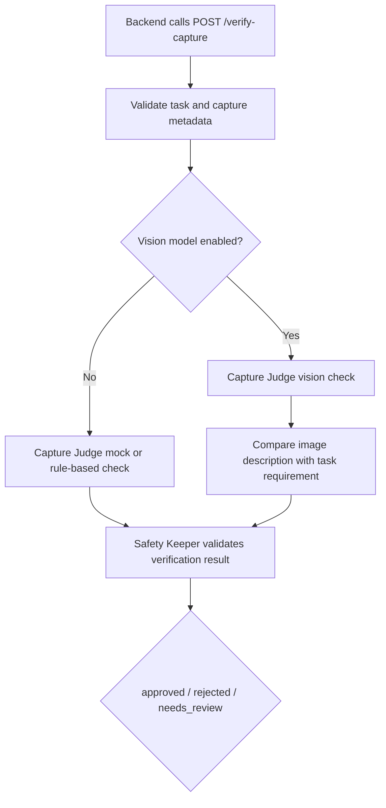
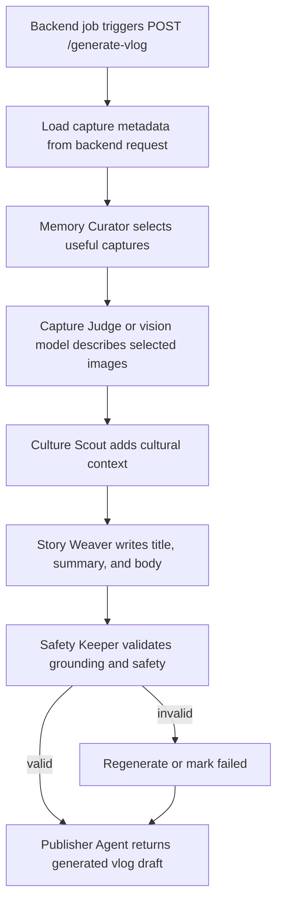

# An-Agent-Based-Smart-Tourism-System-for-Vietnam

`BeVietnam` is a smart tourism system for Vietnam which helps travelers discover meaningful cultural places, complete storyline-based exploration tasks, receive personalized recommendations, and generate travel memories through AI-assisted vlog/daily generation. This system supports for Android application and Website. A native iOS app can be added later when my team has access to Mac hardware or a CI/cloud to build workflow for iOS :)

We hope our system will become a helpful companion for both domestic and international travelers who may feel overwhelmed by the vast amount of information about destinations in Vietnam.

To provide the best possible experience for travelers who wish to explore and learn more about the country, our team developed this application with Vietnamese culture at its core. The system is designed to deliver cultural information in the most vivid and engaging ways possible through personalized feeds, daily tasks that encourage travelers to experience things firsthand, and more.

## Tech Stack

This project is built with a multi-platform architecture, including a native Android application, a responsive web application, a backend API, and an AI-powered core system.

| Layer | Technology | Usage |
|---|---|---|
| **Mobile App** | Kotlin | Main programming language for the native Android application. |
|  | Android SDK | Provides core Android features and platform APIs. |
|  | Jetpack Compose | Used to build modern native Android UI. |
|  | Retrofit / OkHttp | Handles API communication between the mobile app and backend services. |
|  | CameraX | Supports photo capture for check-ins and travel tasks. |
|  | Google Maps SDK | Provides map-based place discovery and location features. |
| **Web App / PWA** | React / Next.js | Builds the responsive web application for desktop and iPhone users. |
|  | TypeScript | Adds type safety and improves frontend maintainability. |
|  | Tailwind CSS | Used for fast and consistent UI styling. |
|  | PWA Support | Allows users to access core features through a browser-based app experience. |
| **Backend API** | FastAPI | Main backend framework for building RESTful APIs. |
|  | Python | Core programming language for backend services and AI integration. |
|  | PostgreSQL | Stores user data, places, tasks, captures, and travel history. |
|  | SQLAlchemy | Handles database models and ORM operations. |
|  | Alembic | Manages database migrations. |
|  | JWT Authentication | Secures user login and protected API routes. |
| **AI Core / Agent System** | Python | Main language for AI workflows and agent logic. |
|  | LangChain / LangGraph | Used to build AI agents, retrieval flows, and reasoning pipelines. |
|  | Vector Database | Stores and retrieves cultural knowledge for recommendation and task generation. |
|  | LLM API | Powers cultural explanation, personalized suggestions, and generated travel content. |
| **Infrastructure & DevOps** | Docker | Containerizes backend and AI services for consistent development and deployment. |
|  | GitHub Actions | Handles CI/CD workflows. |
|  | Cloud Storage | Stores user-uploaded photos and generated media assets. |

## AI Agent Architecture

The AI Core is a separate service from the main backend. The backend owns product data and user-facing APIs, while the AI Core owns retrieval, reasoning, generation, validation, and agent workflows.

The system should not be one uncontrolled chatbot. Each AI feature should be implemented as a controlled workflow with clear inputs, structured outputs, validation, and fallback behavior.

Recommended AI Core stack:

| Responsibility | Recommended Tool |
|---|---|
| Agent workflow orchestration | LangGraph |
| LLM/tool integration | LangChain |
| API service | FastAPI |
| Structured request/response validation | Pydantic |
| Cultural knowledge retrieval | Qdrant |
| Relational product state | PostgreSQL, owned by Backend API |

### C4 Level 1 — System Context



### C4 Level 2 — Container Architecture



### C4 Level 3 — AI Core Components



### Named AI Agents

The project uses friendly agent names so the team can discuss the architecture easily. These names are product-facing architecture labels; implementation can still use clear Python module names such as `culture_scout.py` or `quest_maker.py`.

| Agent | Technical Role | Main Responsibility | Runs In Realtime? |
|---|---|---|---|
| **Culture Scout** | Cultural Retrieval Agent | Finds cultural facts, heritage snippets, and place-related knowledge from Qdrant. | Yes, but it is vector search, not necessarily an LLM call. |
| **Quest Maker** | Task Generator Agent | Creates cultural exploration tasks from user context, nearby places, interests, and retrieved facts. | Yes, for storyline task generation. |
| **Trip Advisor Agent** | Feed Explanation Agent | Explains why a place is recommended now. | Sometimes; can be skipped or templated for faster feed responses. |
| **Capture Judge** | Capture Verification Agent | Checks whether a user's capture satisfies the current task. | Prefer async if real vision model is used. |
| **Memory Curator** | Vlog Curator Agent | Selects useful captures from a user's day for memory/vlog generation. | No, background job. |
| **Story Weaver** | Vlog Narrator Agent | Writes the generated travel memory, summary, and narrative. | No, background job. |
| **Safety Keeper** | Validation and Safety Agent | Validates output format, safety, grounding, and fallback decisions. | Yes for lightweight checks; deeper checks can run async. |
| **Publisher Agent** | Publishing Agent | Packages final AI output for the backend to store or return. | Usually background or final workflow step. |

#### Culture Scout

**Purpose:** retrieve trustworthy cultural context before any generation happens.

**Inputs:**

- place id or place name;
- user location;
- user interests;
- query or task context;
- preferred language if available.

**Outputs:**

- cultural facts;
- related place snippets;
- source metadata;
- confidence score.

**Implementation notes:**

- Uses Qdrant vector search.
- Should be fast enough for realtime flows.
- Should not invent cultural facts; if retrieval is weak, return low confidence.

#### Quest Maker

**Purpose:** generate a storyline task that encourages the traveler to explore culture actively.

**Inputs:**

- user location;
- nearby places;
- user interests;
- weather or time context if available;
- Culture Scout retrieval results.

**Outputs:**

- task title;
- task description;
- cultural explanation;
- completion requirement;
- difficulty;
- reason codes.

**Implementation notes:**

- Uses one LLM call in the normal path.
- Must return structured JSON.
- Should fall back to a safe generic cultural task when generation fails.

#### Trip Advisor Agent

**Purpose:** explain recommendations in a short, useful, and trustworthy way.

**Inputs:**

- ranked place candidate;
- user interests;
- distance/context/weather;
- cultural facts from Culture Scout;
- ranking score factors from backend.

**Outputs:**

- short explanation;
- reason codes;
- optional confidence score.

**Implementation notes:**

- Should be concise because it appears in the feed UI.
- Can use templates in MVP to reduce latency and cost.
- Should not re-rank the whole feed; backend owns ranking for MVP.

#### Capture Judge

**Purpose:** verify if a capture is valid evidence for a task.

**Inputs:**

- task requirement;
- image or image metadata;
- location metadata;
- timestamp;
- optional place/task context.

**Outputs:**

- `approved`, `rejected`, or `needs_review`;
- reason;
- confidence.

**Implementation notes:**

- MVP can start with mock or rule-based verification.
- Real vision verification should run asynchronously if latency is high.
- Low confidence should return `needs_review`, not a hard rejection.

#### Memory Curator

**Purpose:** select the best captures for daily memory/vlog generation.

**Inputs:**

- captures for a user and date;
- task completion data;
- place links;
- timestamps and metadata.

**Outputs:**

- selected captures;
- ordering;
- selection reasons.

**Implementation notes:**

- Runs in background.
- Should limit the number of selected captures to control model cost.
- Can start as deterministic filtering before using an LLM.

#### Story Weaver

**Purpose:** turn selected captures and cultural context into a generated travel memory.

**Inputs:**

- selected captures;
- image descriptions;
- Culture Scout context;
- user language preference;
- tone preference if available.

**Outputs:**

- vlog title;
- summary;
- markdown body;
- safety status.

**Implementation notes:**

- Runs in background.
- Should avoid hallucinating places or events not supported by metadata or retrieved context.
- Should write in a warm travel-diary style, not a generic tourist article.

#### Safety Keeper

**Purpose:** validate AI outputs before they are returned or stored.

**Inputs:**

- generated task, explanation, verification result, or vlog draft;
- expected schema;
- retrieved context;
- safety rules.

**Outputs:**

- valid/invalid decision;
- corrected output if safe to repair;
- fallback instruction if invalid.

**Implementation notes:**

- Should be rule-based first: schema checks, required fields, length limits, unsafe terms, missing grounding.
- Can use an LLM safety check later for complex outputs like vlogs.
- Realtime workflows should keep this lightweight.

#### Publisher Agent

**Purpose:** prepare final AI workflow output for backend consumption.

**Inputs:**

- validated AI output;
- workflow metadata;
- source ids;
- status.

**Outputs:**

- final JSON response for backend;
- job status payload;
- trace/debug metadata if needed.

**Implementation notes:**

- AI Core should not directly mutate backend-owned PostgreSQL tables.
- The Publisher Agent returns a structured payload; backend decides whether to store it.
- For background jobs, it should include enough metadata for retry/debug.

### Agent Runtime Strategy

Not every agent runs for every request.

| Feature | Agents Used | Latency Strategy |
|---|---|---|
| Storyline task generation | Culture Scout → Quest Maker → Safety Keeper → Publisher Agent | Realtime, usually one vector search and one LLM call. |
| Feed recommendation explanation | Culture Scout → Trip Advisor Agent → Safety Keeper | Realtime only when explanation is needed; can use templates for speed. |
| Capture verification | Capture Judge → Safety Keeper → Publisher Agent | Mock/rule-based first; real vision can run async. |
| Vlog generation | Memory Curator → Culture Scout → Story Weaver → Safety Keeper → Publisher Agent | Background job; multiple agents are acceptable. |

### Agent Workflow — Cultural Task Generation

This workflow powers storyline tasks. The backend sends user context to AI Core, and AI Core returns a structured task that Android or web can display.



Expected response shape:

```json
{
  "title": "Find a local cultural detail",
  "description": "Capture one photo of a place detail that represents local culture.",
  "cultural_explanation": "Small architectural and visual details often reveal local identity.",
  "completion_requirement": "Upload one photo with location metadata.",
  "difficulty": "easy",
  "reason_codes": ["culture", "nearby", "beginner_friendly"]
}
```

### Agent Workflow — Recommendation Explanation

This workflow explains why a place is recommended. The ranking can start as backend heuristics, while AI Core provides natural-language explanation.



### Agent Workflow — Capture Verification

This workflow checks whether a user's capture satisfies a storyline task. In the MVP, this can begin as a mock or rule-based workflow before real vision verification is added.



### Agent Workflow — Vlog Generation

This workflow will be used later by a scheduled backend job. It turns one day of captures into a generated travel memory.



### AI Core API Contract Draft

| Endpoint | Called by | Purpose | MVP behavior |
|---|---|---|---|
| `GET /health` | Backend / Dev team | Check AI Core availability | Real endpoint |
| `POST /retrieve-cultural-context` | Backend / AI graphs | Retrieve cultural facts | Qdrant or mock retrieval |
| `POST /generate-task` | Backend storyline API | Generate next cultural task | LangGraph task workflow |
| `POST /explain-recommendation` | Backend feed API | Explain recommendation reasons | LangGraph explanation workflow |
| `POST /verify-capture` | Backend capture API | Verify task completion evidence | Mock/rule-based first |
| `POST /generate-vlog` | Backend worker/job | Generate travel memory draft | Later-phase LangGraph workflow |

### AI Core Design Rules

1. Backend owns product data. AI Core should not directly mutate PostgreSQL product tables.
2. AI Core returns structured JSON. Android, web, and backend should not parse free-form prose as data.
3. Every graph needs fallback behavior. If model calls fail, return safe mock/default output.
4. Retrieval comes before generation. Cultural claims should be grounded in retrieved context whenever possible.
5. Start with mocks, then replace with real AI. The team should demo vertical slices before building complex agents deeply.
6. Keep workflows explicit. LangGraph nodes should map clearly to retrieval, generation, validation, and fallback steps.

## Backend API Sprint 1

The backend branch adds a FastAPI service with health, places, feed, storyline, captures, and logs endpoints.

### Local Setup

```bash
cp .env.example .env
py -m pip install fastapi uvicorn[standard] httpx python-dotenv pydantic pydantic-settings
py -m uvicorn app.main:app --reload
```

Server runs at `http://localhost:8000`, and Swagger API docs are available at `http://localhost:8000/docs`.

### Smoke Test Endpoints

```text
GET  /api/v1/health
GET  /api/v1/places
GET  /api/v1/places?category=temple
GET  /api/v1/feed
GET  /api/v1/storyline/next-task?user_id=user-001
POST /api/v1/captures
```

Notes from the backend branch:

- AI Core is mocked by default with `AI_CORE_USE_MOCK=true`.
- Captures are stored in memory for Sprint 1.
- CORS is open for development and should be restricted before production.

